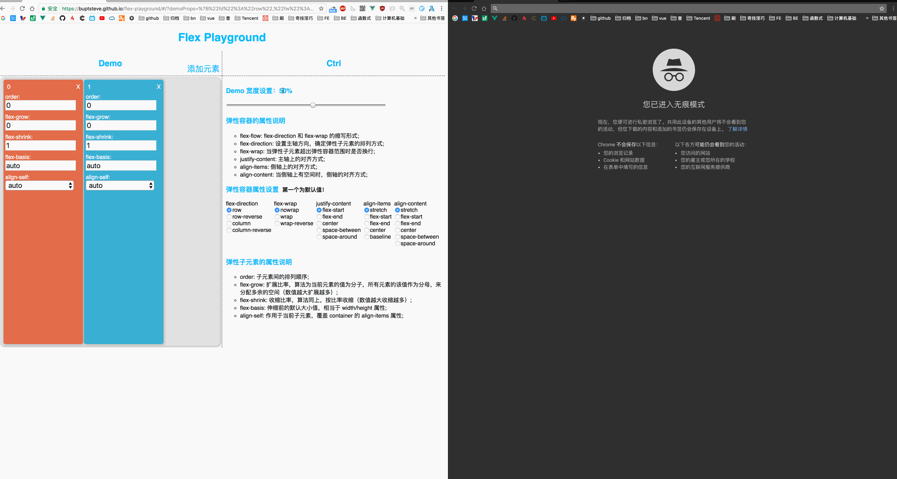

# css3 flex 的小 Demo

## 一、弹性容器 flex container:
### 1. display:
* 说明：首先必须设置该属性，才能应用 flex 的属性;
* 取值：flex | inline-flex;

### 2. flex-flow(以下两个属性的缩写形式): [flex-direction] || [flex-wrap]
* flex-direction:
    * 说明：设置主轴方向，确定弹性子元素的排列方式;
    * 取值：row(default) | row-reverse | column | column-reverse;

* flex-wrap:
    * 说明：当弹性子元素超出弹性容器范围时是否换行;
    * 取值：nowrap(default) | wrap | wrap-reverse;

### 3. justify-content:
* 说明：主轴上的对齐方式;
* 取值：flex-start | flex-end | center | space-between | space-around;

### 4. align-items:
* 说明：侧轴上的对齐方式;
* 取值：stretch(default) | flex-start | flex-end | center | baseline;

### 5. align-content:
* 说明：当侧轴上有空间时，侧轴的对齐方式;
* 取值：stretch(default) | flex-start | flex-end | center | space-between | space-around;

## 二、弹性子元素 flex items:
### 1. order:
* 说明：排列顺序;
* 取值：整数;

### 2. flex(以下三个属性的缩写形式): none | [flex-grow] || [flex-shrink] || [flex-basis]
* flex-grow:
    * 说明：扩展比率，算法为当前元素的值为分子，所有元素的该值作为分母，来分配多余的空间（数值越大扩展越多）;
    * 取值：非负数值;（default 0）
* flex-shrink:
    * 说明：收缩比率，算法同上，按比率收缩（数值越大收缩越多）;
    * 取值：非负数值;（default 1）
* flex-basis:
    * 说明：伸缩前的默认大小值，相当于 width/height 属性;
    * 取值：(非负！) auto | [length] | [percentage];（default auto）

### 3. align-self:
* 说明：作用于当前子元素，覆盖 container 的 align-items 属性;
* 取值：auto | flex-start | flex-end | center | baseline | stretch;
